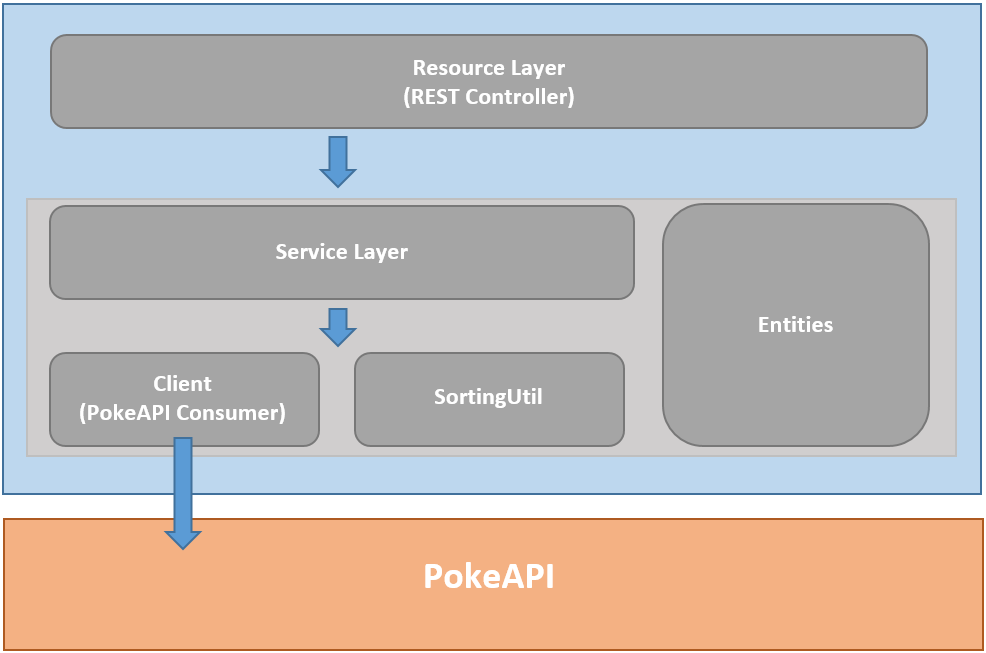

# Repositório do Desafio backend da Looqbox
Repositório criado com a finalidade de entregar o desafio de Backend da Looqbox.

## Sobre o desafio

### Objetivo
Este desafio consiste em contruir um Microsservice utilizando Java e Spring para consumir a PokeAPI e fornecer um endpoint de consulta de pokemons por substring, retornando uma resposta ordenada por dois algoritmos (sem uso de bibliotecas): Comprimento do nome e ordem alfabética. O retorno também deverá mostrar um highlight de qual trecho no nome a substring foi encontrada.

### Integração
O projeto tem integração com a API PokeAPI para realizar a consulta dos dados dos Pokemons. Mais informações no link baixo:
```
https://pokeapi.co/
```
## Funcionalidades
### - Endpoint de consulta -
```
GET  /v1/pokemons
```
* A consulta dos pokemons é realizada através do endpoint mencionado acima. A API irá consultar os Pokemons que contenham em seu nome a substring passada por parâmetro, como no exemplo abaixo:
```
GET  /v1/pokemons?query=charm

Exemplo de retorno:
{
    "results": [
        {
            "name": "charmander",
            "start": 0,
            "end": 5
        },
        {
            "name": "charmeleon",
            "start": 0,
            "end": 5
        }
    ]
}
```
* !!! Se não for passado nenhuma string no parâmetro, por padrão serão retornados todos os pokemons listados na PokeAPI !!!

### - Exception Personalizada -

* Se nenhum pokemon for encontrado com a substring passada, será retornado uma response personalizada como no exemplo abaixo:
```
GET  /v1/pokemons?query=zzzz

Exemplo de retorno:
{
    "timestamp": "2022-01-25T02:21:35.178428500Z",
    "status": 404,
    "error": "Empty Result",
    "message": "No Pokemons Found for substring: zzzz",
    "path": "/v1/pokemons"
}
```

## Diagrama do projeto


## Tecnologias utilizadas
#### - Frameworks e linguagens-
* Java 11; 
* Spring 2.6.3;

## Configurações Locais
* Para este projeto não foi necessário nenhuma configuração adicional local. Basta clonar e executar, desde que o ambiente Java esteja na mesma versão.


---
### Informações originais do repositório do desafio

# Looqbox Backend Challenge

### Would you like to work with us? Apply [here](https://app.pipefy.com/public_form/840222)!

## Challenge
In this challenge you will need to build a **Microservice** using the stack below and a provided api.

We will not use anything from your project other than evaluate your skills and you are free to use this project in your portfolio.

## Stack
We use:
- Java/Kotlin
- `Spring Boot` for the framework
- `Gradle` for dependency management and local deployment

## Submitting
- Make a fork of this repository
- When you're done send us a pull request

# Guidelines
You need to make a HTTP REST API that 
- Consumes the [PokeAPI](https://pokeapi.co/) data.
- Provides an endpoint to query pokemons based on the substring of its name. For example:
  - Request: `GET /pokemons?q=pidge`
  - Expected response: ```{"result" : ["pidgey", "pidgeotto", "pidgeot"]}```
- You need to apply sorting by two algorithms (it is not permitted to use a sorting library, for this particular feature you must implement by yourself). And it’s very important to explain your implemented logic (For instance, you can use inline comments on the source code): 
  - the pokemon name's length and; 
  - the pokemon name's alphabetical order 
 
- Find a way to indicate the pokemon name highlight regarding the piece of its queried name. For example:
  - The queried name was `pi`
  - The highlight object must be ```{"name": "pikachu", "highlight": "<pre>pi</pre>kachu"}``` or ```{"name": "pikachu", "start": 0, "end": 2}```
- Draw a diagram explaining your architecture

## Bonus points!
- Design Patterns
- Unit Testing
- Dockerize the application
- Explain the Big-Ω (time complexity) of your sorting algorithms (explain how you calculated them)

## Useful links
- [Spring Framework](https://spring.io/)
- [Gradle](https://gradle.org/)
- [PokeApi docs](https://pokeapi.co/docs/v2.html)
